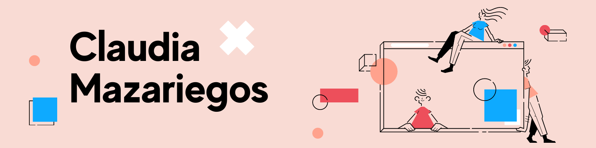

<!-- 
 -->
  
<!--    -->
<!-- 

 -->
<h1 align="center">Hello</h1>

  👩🏻‍💻 Software Engineer 
  💬 Passionate about App Development and Technology 
  🌀 Currently working on personal app and learning about all things React

---

<h3 align="center">Languages and Tools</h3>

 
   
   
   
   
   
  
  

---

  
<!--    -->

 
  
<!--     -->
<!--    -->

---

<h3 align="center">Let's Connect! </h3>

  
  

